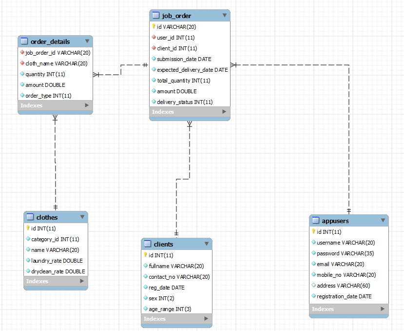
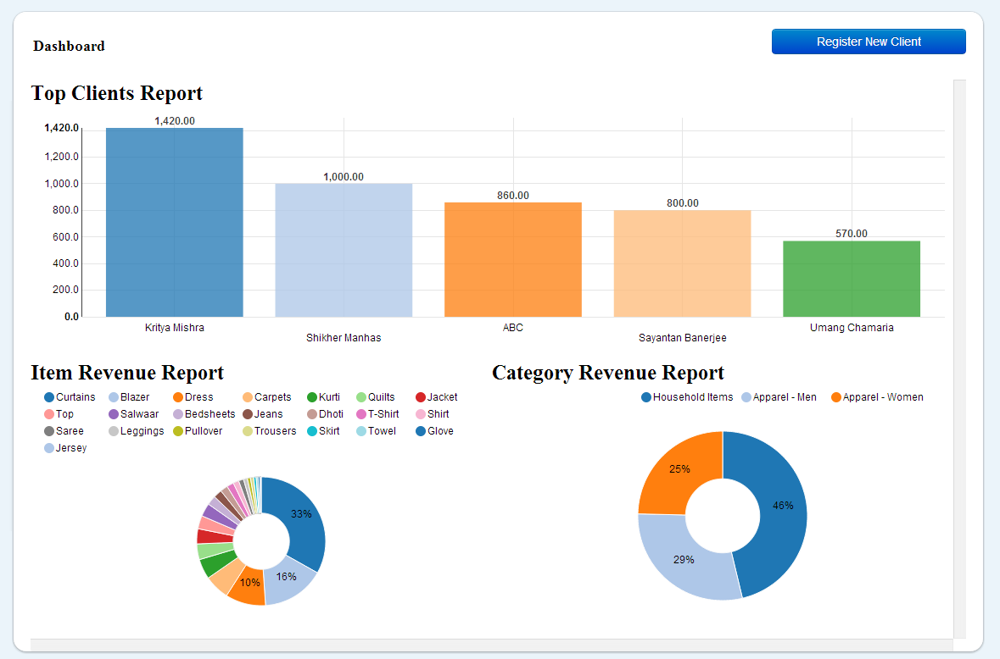

Laundry Management System
=========================

This is a web-based tool, a very simple alternative to using Excel for a basic laundry service setup.

The initial requirements for this were for a single office setup with no security issues. Hence, it does not use the secure protocol and is written in PHP without the use of any frameworks.

It has a very clean UI which uses Bootstrap and nvd3.js for chart-generation and is backed by the following tables :-

A view of the landing dashboard (Note :- There is no separation of roles/privileges as of now)

